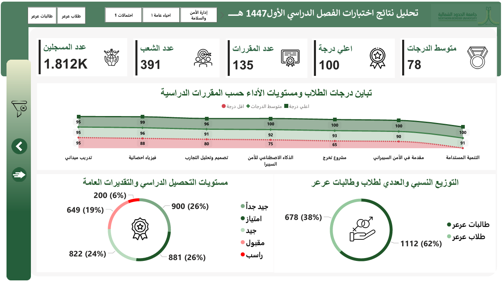
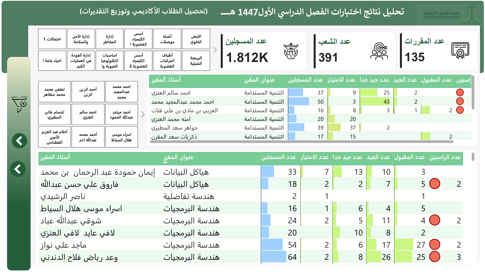

# 🎓 NBU Student Data Analysis Dashboard
## Project Overview
This project is a comprehensive Data Visualization & Analysis Dashboard developed for Northern Border University (NBU) in Saudi Arabia. The dashboard is designed to monitor and analyze student-related data, providing university leadership with a clear view of academic performance, registration trends, and institutional KPIs.

## Objectives
- Academic Monitoring: Track student progress and performance metrics across different colleges.

- Data-Driven Decisions: Provide stakeholders with real-time insights to improve educational quality and resource allocation.

- Trend Analysis: Identify patterns in student enrollment, graduation rates, and attendance.

- Process Optimization: Simplify complex datasets into interactive visual stories for administrative efficiency.

## Dashboard Screenshots

## Tools & Technologies
- Power BI: The primary tool for building interactive dashboards and complex data modeling.

- DAX (Data Analysis Expressions): Used to calculate sophisticated academic KPIs and performance ratios.

- Power Query: For cleaning university datasets and ensuring data integrity.

- Microsoft Excel/SQL: As the underlying data sources for student records.

## Data Processing Steps
1. Data Integration: Consolidating student records from various departmental sources.

2. Cleaning & Transformation: Standardizing data formats and handling academic year classifications.

3. Modeling: Creating a robust data model to support multi-dimensional analysis (by Gender, College, Major, etc.).

4. Visual Design: Implementing a user-friendly interface aligned with NBU’s institutional standards.

## Key Insights
- Demographic Breakdown: Detailed analysis of student distribution by college and gender.

- Performance Indicators: Identification of high-performing departments and areas requiring academic support.

- Registration Trends: Visualizing peak periods and enrollment growth over multiple semesters.

## How To Use This Project
- Open the Power BI file (.pbix) located in the project folder.

- Use the Slicers on the left to filter by Academic Year, College, or Semester.

- Hover over charts to see detailed tooltips and specific data points.

- Drill through the reports to see granular student-level statistics.

## Author
Amr Osama 
Data Scientist | Power BI Developer

LinkedIn: https://www.linkedin.com/in/amr-osama-el-sayed

Portfolio: https://mostaql.com/u/Amr_Osama_EL/portfolio